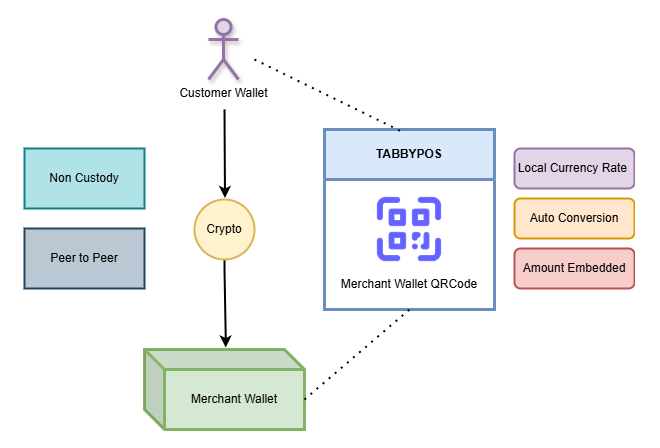
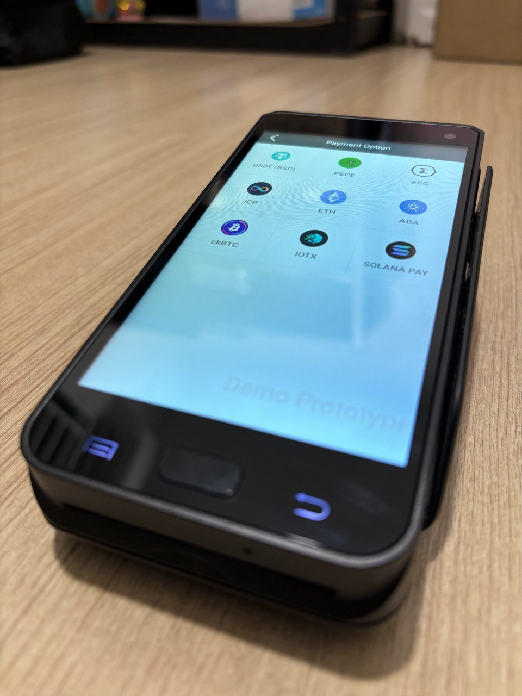
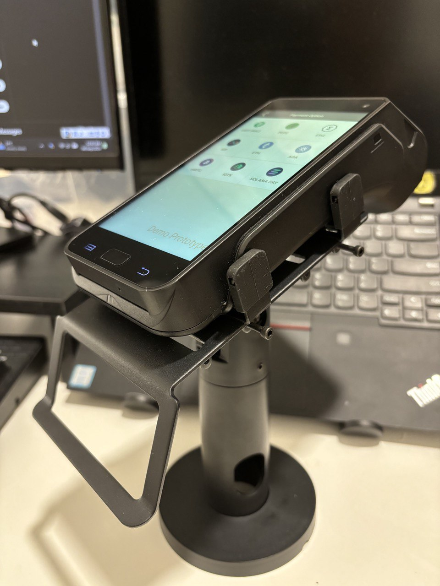

# TabbyPOS-Introduction-CN
#### Web3 加密货币 POS | 将去中心化支付带入现实商业世界
TabbyPOS是一个加密货币POS系统，使商家能够无缝接受加密支付。它支持多个区块链，包括 Ergo, IoTeX, ICP, BSC, APTOS, Pi Network 和 Solana，提供快速、安全且高效的交易体验。借助 TabbyPOS，商家可以轻松将加密支付集成到业务中，同时受益于去中心化且可扩展的基础设施。

## TabbyPOS 目前的成就： 
1. 🏆 获得 ICP Dfinity 基金会的资助支持，并成功完成指定里程碑。 
2. 🏆 获得 Solana 基金会的资助支持，并成功完成指定里程碑。 
3. 🏆 获得 APTOS 基金会的资助支持，并成功完成指定里程碑。 
4. 🏆 获得 GUI INU 黑客松第3名。 
5. 🚀 已经上线Google Play Store。 
6. 🔥 被币安链官方部落格介绍过。 

#### 成功集成的链如下: 
1. ✅ Ergo
2. ✅ ICP 
3. ✅ Solana
4. ✅ Pi Network
5. ✅ BSC
6. ✅ APTOS
  

## 如何工作 ?    
TabbyPOS 采用点对点支付方式，加密货币直接从用户钱包转至商家钱包，我们不经手或托管任何一方的资产，因此不涉及资产托管或转移的合规问题。我们提供的设备集成多链功能，并配备后台系统用于查看支付记录，让商家和客户支付更便捷，管理更高效。
  

 

## 社交媒体 
- 🐦 X(推特) : https://x.com/tabbypos 
- ✈️ 电报 : https://t.co/TCS1rxjBTL 
- 🔗 网站 ：https://www.tabbylab.io/ 

## 团队 
**Lee Koh Ching** 
全栈开发者 
LinkedIn : https://www.linkedin.com/in/koh-ching-lee-7b120756/ 

**Teh Chiou Shing** 
商务开发 
X(推特) : https://twitter.com/Cstehbeauty 

## 代币
### $TABBY 
- ⛓️ 链 : BSC   
- 🏦 DEX : https://shorturl.at/6o6Xa 
- 🏦 CEX : https://nonkyc.io/market/TABBY_USDT  
- 📜 合约Ca : 0x319558c8aD708dc42f45ab70eADA4750d6c942d7

### 盈利模式 💵💵 
1. 📱 销售 POS 设备
2. 📦 提供 POS 机硬件与软件的 OEM 服务
3. 🛠 提供软件定制开发服务
4. 💰加密货币转换法币手续费（TabbyPOS 2.0）

### 下载TabbyPOS    
https://t.co/MhNCNNJVzG

### 商家是获得发币还是加密币？
- TabbyPOS 1.0 商家最终收到加密货币
- TabbyPOS 2.0 集成兑换服务，商家可选择直接将加密货币兑换为法币

### 短期目标
- 打磨产品、推动商用化、精心包装、成功落地，实现创收！

### 长期目标
- 获取加密币转换法币的牌照（加密货币交易所牌照）

## 📺 观看演习视频 
[BSC Pay Demo](https://x.com/i/status/1896966445701173386)
  
[Solana Pay Demo](https://x.com/tabbypos/status/1871878777942536606/video/1)
  
[ICP Pay Demo](https://x.com/i/status/1791378929812705525)
  
[Aptos Pay Demo](https://x.com/i/status/1924150206830088688)
  
## 🖼️ 产品照片 

 

